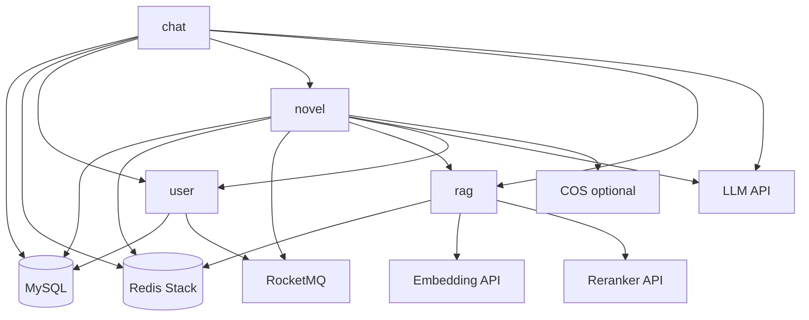

# novel-latest

<div align="center">

[](https://www.oracle.com/java/)
[](https://spring.io/projects/spring-boot)
[](https://spring.io/projects/spring-ai)
[](https://dubbo.apache.org/)
[](https://rocketmq.apache.org/)

**小说角色画像构建与角色聊天系统 | Spring Boot + Dubbo + RAG + LLM + Vue**

[项目概述](#项目概述) • [快速开始](#快速开始) • [架构说明](#架构说明) • [本地验证](#本地验证) • [常见问题](#常见问题)

</div>

---

## 项目概述

`novel-latest` 是一个多模块 Java 21 项目，用于上传小说文本、构建角色运行时画像，并在聊天服务中结合 RAG 和 LLM 进行角色对话。

### 核心能力

- **小说上传**：支持本地文件存储，按配置可切换到腾讯云 COS。
- **角色构建 Pipeline**：围绕章节分析、Passage 切分、角色样本、反应规则和画像构建组织异步任务。
- **RAG 服务**：使用 Redis Stack Vector Store 保存 Passage、角色样本和反应规则向量。
- **角色聊天**：chat 模块通过 Dubbo 获取角色运行时上下文，并结合 RAG 内容请求 LLM。
- **用户认证**：user 模块签发 JWT，novel/chat 使用同一 `JWT_SECRET` 校验 Bearer Token。
- **任务通知**：Pipeline 完成后通过 RocketMQ 通知 user 模块，可按配置发送邮件。

### 当前边界

- 本地基础设施由 Compose 提供；四个 Java 应用不放进 Compose。
- 数据库初始化使用手工 `schema.sql`。
- `src/test` 当前只作为本地回归资产维护，不提交 Git。
- LLM、Embedding、Reranker、COS、邮件等真实外部能力只在调用对应功能时需要配置密钥。

---

## 架构说明

### 模块与端口

| 模块 | HTTP 端口 | Dubbo 端口 | 主要职责 |
| --- | --- | --- | --- |
| `user` | `8082` | `50052` | 注册、登录、用户校验、任务通知邮件 |
| `rag` | `8083` | `50053` | Embedding、Redis Vector Store、Rerank |
| `novel` | `8080` | `50051` | 小说上传、画像构建任务、进度查询 |
| `chat` | `8081` | 无 | 会话、消息、角色上下文聊天 |
| `web` | `5173`（开发） | 无 | 角色大厅、个人评测与沉浸式聊天前端 |

### 本地依赖

| 依赖 | 端口 | 说明 |
| --- | --- | --- |
| MySQL | `3306` | 数据库 `novel_dev`，本地允许空 root 密码 |
| Redis Stack | `9379 -> 6379` | Redis + RedisSearch，供缓存和向量索引使用 |
| RocketMQ NameServer | `9876` | 消息服务发现 |
| RocketMQ Broker | `10911` | 任务完成通知消息 |

### 服务关系



### 项目结构

```text
novel-latest/
├── api/                         # Dubbo 公共接口与 DTO
├── common/                      # 通用响应、异常、安全、Redis、日志组件
├── user/                        # 用户、认证、任务通知邮件
│   └── src/main/resources/db/schema.sql
├── novel/                       # 小说上传、Pipeline、任务进度、向量索引协调
│   └── src/main/resources/db/schema.sql
├── rag/                         # Embedding、Redis Vector Store、Rerank
├── chat/                        # 会话、消息、角色运行时聊天
│   └── src/main/resources/db/schema.sql
├── web/                          # Vue 3 角色大厅，生产环境由 Nginx 托管
├── deploy/rocketmq/broker.conf  # 本地 RocketMQ Broker 配置
├── compose.yaml                 # 本地基础设施编排
└── README.md
```

### 技术栈

| 技术 | 版本 | 用途 |
| --- | --- | --- |
| Java | 21 | 运行时与编译目标 |
| Spring Boot | 3.5.16 | Web、配置、依赖管理 |
| Spring AI | 1.1.7 | LLM、Embedding、Vector Store 集成 |
| Apache Dubbo | 3.3.2 | 模块间 RPC |
| RocketMQ Spring | 2.3.6 | 异步任务通知 |
| MyBatis-Plus | 3.5.10 | 数据访问 |
| MySQL | 8.x | 业务数据 |
| Redis Stack | 7.2.x | 缓存与向量索引 |

---

## 快速开始

### 1. 环境要求

- JDK 21
- Maven 3.9+
- Docker 与 Docker Compose
- MySQL 客户端，或其他可以执行 SQL 文件的工具

### 2. 启动基础设施

```powershell
docker compose -f compose.yaml up -d
docker compose -f compose.yaml ps
```

停止：

```powershell
docker compose -f compose.yaml down
```

验证 Compose 文件：

```powershell
docker compose -f compose.yaml config
```

### 3. 初始化数据库

本地数据库初始化入口是下面三个 `schema.sql`：

```powershell
mysql -h 127.0.0.1 -P 3306 -uroot novel_dev < user/src/main/resources/db/schema.sql
mysql -h 127.0.0.1 -P 3306 -uroot novel_dev < novel/src/main/resources/db/schema.sql
mysql -h 127.0.0.1 -P 3306 -uroot novel_dev < chat/src/main/resources/db/schema.sql
```

已有数据库需要变更结构时，先更新对应 `schema.sql`，再在变更说明中给出可手工执行的 `ALTER` SQL。

### 4. 设置本地环境变量

基础配置会自动激活 `dev` profile；本地启动只需设置 JWT 密钥：

```powershell
$env:JWT_SECRET = "replace-with-at-least-32-byte-local-secret"
```

四个 Java 应用必须使用同一个 `JWT_SECRET`，否则 `user` 签发的 token 无法被 `novel` 和 `chat` 校验。

常用本地默认值：

```powershell
$env:MYSQL_HOST = "localhost"
$env:MYSQL_PORT = "3306"
$env:MYSQL_DATABASE = "novel_dev"
$env:MYSQL_USERNAME = "root"
$env:MYSQL_PASSWORD = ""
$env:REDIS_HOST = "localhost"
$env:REDIS_PORT = "9379"
$env:ROCKETMQ_NAME_SERVER = "localhost:9876"
```

只有调用真实能力时才需要额外配置：

- LLM：`DS_API_KEY`，可选 `DS_BASE_URL`
- Embedding / Reranker：按 `rag` 模块配置项设置对应 API Key、URL 和模型
- COS：仅当 `NOVEL_STORAGE_TYPE=cos` 时需要 `TENCENT_COS_SECRET_ID`、`TENCENT_COS_SECRET_KEY`、`TENCENT_COS_REGION`、`TENCENT_COS_BUCKET_NAME`
- 邮件：仅当 `USER_MAIL_ENABLED=true` 时需要 `RESEND_API_KEY` 和 `RESEND_MAIL_FROM`

不要把真实密钥写入 README、提交、日志或示例命令。

### 启用任务完成邮件

user 服务会消费任务完成消息，但邮件通知默认关闭。需要真实发送邮件时，在启动 user 服务的终端设置：

```powershell
$env:USER_MAIL_ENABLED = "true"
$env:RESEND_API_KEY = "replace-with-resend-api-key"
$env:RESEND_MAIL_FROM = "verified-sender@example.com"
```

修改环境变量后必须重启 user 服务。任务所属用户必须处于 `ACTIVE` 状态并且已填写邮箱；未启用邮件时，user 日志会记录跳过发送的原因。

### 5. 编译并启动 Java 应用

建议按下面顺序启动：

1. `user`
2. `rag`
3. `novel`
4. `chat`

先编译核心模块：

```powershell
$env:JWT_SECRET = "replace-with-at-least-32-byte-local-secret"

mvn -pl user,novel,chat,rag -am "-Dmaven.test.skip=true" compile
```

再在不同终端分别启动：

```powershell
mvn -pl user spring-boot:run
mvn -pl rag spring-boot:run
mvn -pl novel spring-boot:run
mvn -pl chat spring-boot:run
```

如果在不同终端启动，确保每个终端都设置了相同的 `JWT_SECRET`。

### 6. 启动角色大厅前端

先启动 `novel` 和 `chat` 服务，再在新终端执行：

```powershell
cd web
npm install
npm run dev
```

浏览器访问 `http://localhost:5173`。Vite 会将 `/api/` 自动代理到 `http://localhost:8080`，并将 `/api/chat/` 自动代理到 `http://localhost:8081`；公共大厅只请求脱敏角色预览数据，不会展示完整画像、反应规则或原作样本。

个人角色和评测页面复用已有登录服务签发的 JWT。当前前端不提供登录页；完成登录后，将 token 写入浏览器控制台中的 `localStorage.access_token`，刷新页面即可联调受认证的工作区和评测操作。

生产静态镜像可独立构建，Nginx 会将 `/api/` 代理到同一 Docker 网络中的 `novel:8080`，并将 `/api/chat/` 代理到 `chat:8081`：

```powershell
docker build -t novel-role-hall ./web
```

---

## 最小链路验证

注册：

```powershell
curl -X POST http://localhost:8082/auth/register `
  -H "Content-Type: application/json" `
  -d '{"username":"alice","nickname":"Alice","email":"alice@example.local","password":"local-password"}'
```

登录并保存 token：

```powershell
$login = curl -s -X POST http://localhost:8082/auth/login `
  -H "Content-Type: application/json" `
  -d '{"account":"alice","password":"local-password"}' | ConvertFrom-Json
$token = $login.data.token
```

上传小说文本：

```powershell
curl -X POST http://localhost:8080/novel `
  -H "Authorization: Bearer $token" `
  -F "file=@D:/tmp/example-novel.txt"
```

创建画像构建任务：

```powershell
curl -X POST http://localhost:8080/novel/createJob `
  -H "Authorization: Bearer $token" `
  -H "Content-Type: application/json" `
  -d '{"novelId":1,"protagonistName":"主角","targetName":"目标角色"}'
```

提交任务处理：

```powershell
curl -X POST http://localhost:8080/novel/process/1 `
  -H "Authorization: Bearer $token"
```

查询进度：

```powershell
curl http://localhost:8080/novel/progress/1 `
  -H "Authorization: Bearer $token"
```

任务处理会调用 LLM、Embedding、Reranker、Redis 和 RocketMQ；未配置真实模型服务时，不要把处理失败当作基础设施启动失败。

创建聊天会话并发送消息：

```powershell
curl -X POST http://localhost:8081/chat/sessions/1 `
  -H "Authorization: Bearer $token"

curl -X POST http://localhost:8081/chat/sessions/1/messages `
  -H "Authorization: Bearer $token" `
  -H "Content-Type: application/json" `
  -d '{"content":"你好"}'
```

聊天依赖角色画像已经构建完成；如果角色仍不可用，`chat` 会拒绝创建会话。

聊天前端当前使用同步回复接口，同时已预留 `POST /chat/sessions/{sessionId}/messages/stream` 的 SSE 通道，后端切换为 token 流后前端无需改变请求路径。针对已完成评测生成的个人版本，聊天会话会记录对应版本 ID 并在创建时校验归属；当前运行时仍使用公共角色基线。

---

## 本地验证

编译核心模块：

```powershell
mvn -pl user,novel,chat,rag -am "-Dmaven.test.skip=true" compile
```

验证 Compose：

```powershell
docker compose -f compose.yaml config
```

提交前建议检查：

```powershell
git status --short
git diff --cached --check
git diff --cached --name-only
git ls-files -- "*src/test*"
```

---

## 开发约束

### 数据库变更

- 正式脚本只使用三个 `schema.sql`。
- 变更表结构时，同步更新对应 `schema.sql`。
- 对已有数据库，需要在变更说明中写出手工 `ALTER` SQL。

本次聊天会话增加个人版本绑定字段；已有数据库执行：

```sql
ALTER TABLE chat_sessions
  ADD COLUMN user_role_version_id BIGINT NULL COMMENT '用户个人角色版本主键，空表示公共角色基线',
  ADD KEY idx_chat_sessions_user_role_version_id (user_role_version_id);
```

聊天分层记忆使用长期摘要表；已有数据库执行：

```sql
CREATE TABLE chat_session_memories (
  session_id BIGINT PRIMARY KEY COMMENT '聊天会话主键',
  summary_content TEXT NOT NULL COMMENT '当前有效的结构化长期记忆摘要',
  covered_message_id BIGINT NOT NULL COMMENT '摘要已覆盖到的最后一条聊天消息主键',
  version INT NOT NULL DEFAULT 1 COMMENT '摘要乐观并发版本号',
  create_time DATETIME DEFAULT CURRENT_TIMESTAMP COMMENT '创建时间',
  update_time DATETIME DEFAULT CURRENT_TIMESTAMP ON UPDATE CURRENT_TIMESTAMP COMMENT '更新时间'
) ENGINE=InnoDB CHARSET=utf8mb4 COLLATE=utf8mb4_unicode_ci;
```

### 测试策略

- `src/test` 当前只作为本地回归资产维护，不提交 Git。
- 可以创建和运行本地测试，但提交前必须确认暂存区和 Git 跟踪文件中没有 `src/test`。
- 如果未来决定把测试纳入版本控制，需要先明确改变该策略。

### 密钥管理

- 不提交真实密钥、token、本地 properties、日志、data 或 target 输出。
- 本地敏感配置优先使用环境变量。
- 已被忽略的 `tencent-cos.properties` 和 `resend.properties` 不应复制到文档、提交或日志。

---

## 常见问题

### Q1: 为什么服务默认激活 `dev` profile？

这样可以减少本地联调的环境变量配置。部署时可通过 `SPRING_PROFILES_ACTIVE` 显式覆盖为目标环境。

### Q2: 为什么四个服务必须使用同一个 `JWT_SECRET`？

`user` 使用该密钥签发 JWT，`novel` 和 `chat` 使用同一密钥校验 JWT。如果不一致，登录成功后访问其他服务会被判定为无效 token。

### Q3: 不配置 LLM、Embedding、Reranker 能启动吗？

基础编译和部分服务启动可以不配置真实模型密钥。真正执行画像构建、RAG 检索或聊天生成时，需要配置对应外部模型服务。

### Q4: 数据库结构怎么变更？

所有表结构变化都应同步到正式 `schema.sql`，并为已有数据库提供手工 SQL。

### Q5: 为什么 Git 不提交 `src/test`？

这是当前仓库策略：测试先作为本地回归资产维护。后续如需纳入版本控制，需要先明确调整该策略。

### Q6: user 已收到任务完成消息，为什么没有邮件？

邮件通知默认关闭。设置 `USER_MAIL_ENABLED=true`、`RESEND_API_KEY` 和 `RESEND_MAIL_FROM` 后重启 user 服务；还需要确认用户状态为 `ACTIVE` 且邮箱非空。
