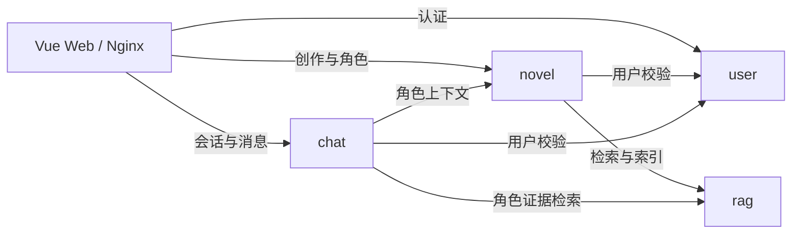
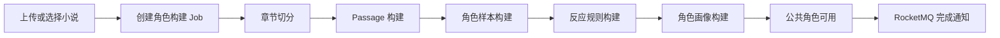
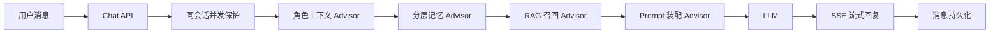

# novel-latest

<div align="center">

[](https://www.oracle.com/java/)
[](https://spring.io/projects/spring-boot)
[](https://spring.io/projects/spring-ai)
[](https://docs.langchain4j.dev/)
[](https://dubbo.apache.org/)
[](https://rocketmq.apache.org/)

**小说角色画像构建与角色聊天系统 | Spring Boot + Dubbo + RAG + LLM + Vue**

[项目概述](#项目概述) • [核心能力](#核心能力) • [架构说明](#架构说明) • [核心链路](#核心链路) • [快速开始](#快速开始) • [未来方向](#未来方向)

</div>

---

## 项目概述

### 开发背景

`novel-latest` 是一个面向长篇小说角色复刻与互动场景的多模块 Java 21 项目。系统从小说原文中提取角色样本、反应规则和结构化画像，再结合 RAG、分层聊天记忆与大语言模型，让角色回复尽量保持原作中的性格、表达方式和行为边界。

与只依赖一段固定角色提示词的方案不同，本项目将小说预处理、角色构建、个人调整和在线聊天拆分为可追踪的完整链路。公共小说与角色构建结果可以复用，用户的个性化调整则以独立版本保存，不会覆盖公共角色。

### 项目特色

- **原文驱动的角色构建**：从 Passage 中抽取角色样本，进一步生成反应规则与角色画像，而不是仅依赖人工编写 Prompt。
- **可复用的公共资源**：小说、章节、Passage 和公共角色面向所有用户复用，避免重复执行高成本预处理。
- **个人角色演进**：用户可以审核 LLM 生成的调整候选，并沿一条版本轨迹持续优化个人角色，不修改公共版本。
- **高级 RAG 编排**：基于 LangChain4j 统一完成查询改写、多路召回、元数据过滤和 Rerank。
- **分层聊天记忆**：通过历史摘要与最近原始消息控制上下文规模，同时保留对话连续性。
- **实时交互与任务恢复**：角色构建进度和聊天回复均支持 SSE，失败任务可以从已有阶段继续处理。

### 核心能力

- **小说上传**：支持本地文件存储，按配置可切换到腾讯云 COS。
- **角色构建 Pipeline**：依次完成章节切分、Passage 构建、角色样本、反应规则和角色画像构建；章节与 Passage 预处理产物按小说共享复用。
- **RAG 服务**：基于 LangChain4j 和 Redis Stack 管理 Passage、角色样本与反应规则向量，统一执行单路/多路查询改写、元数据过滤和 Rerank。
- **角色聊天**：chat 模块使用 Spring AI Advisor 链装配公共或个人角色上下文、历史摘要、最近消息与 RAG 召回结果，通过 SSE 流式回复，并限制同一会话并行发送。
- **创作与任务中心**：公共小说库支持上传、检索、创建任务、实时进度、失败重做与个人任务分页查询。
- **会话中心**：前端提供已有聊天会话入口、最近消息摘要和最近活跃排序。
- **用户认证**：user 模块签发 JWT Access Token，并通过 HttpOnly Cookie 轮换 Refresh Token。
- **任务通知**：Pipeline 完成后通过 RocketMQ 通知 user 模块，可按配置发送邮件。

---

## 架构说明

### 模块与端口

| 模块 | HTTP 端口 | Dubbo 端口 | 主要职责 |
| --- | --- | --- | --- |
| `user` | `8082` | `50052` | 注册、登录、用户校验、任务通知邮件 |
| `rag` | `8083` | `50053` | 查询改写、Embedding、Redis 向量检索、Rerank |
| `novel` | `8080` | `50051` | 小说上传、画像构建任务、进度查询 |
| `chat` | `8081` | 无 | 会话、消息、角色上下文聊天 |
| `web` | `5173`（开发） | 无 | 创作大厅、角色大厅、任务中心、个人调整与聊天前端 |

### 本地依赖

| 依赖 | 端口 | 说明 |
| --- | --- | --- |
| MySQL | `3306` | 数据库 `novel_dev`，本地允许空 root 密码 |
| Redis Stack | `9379 -> 6379` | Redis + RedisSearch，供缓存和向量索引使用 |
| RocketMQ NameServer | `9876` | RocketMQ 5.3.2 消息服务发现 |
| RocketMQ Broker | `10911` | RocketMQ 5.3.2 任务完成通知消息 |

### 服务关系



Java 服务之间通过 Dubbo Triple 调用；数据、消息与外部能力依赖单独列出：

| 服务 | 数据与消息 | 外部能力 |
| --- | --- | --- |
| `user` | MySQL、RocketMQ | 邮件服务 |
| `novel` | MySQL、Redis Stack、RocketMQ | LLM API、腾讯云 COS（可选） |
| `rag` | Redis Stack | LLM、Embedding、Reranker API |
| `chat` | MySQL、Redis Stack | LLM API |

### 项目结构

```text
novel-latest/
├── api/                         # Dubbo 公共接口与 DTO
├── common/                      # 通用响应、异常、安全、Redis、日志组件
├── user/                        # 用户、认证、任务通知邮件
│   └── src/main/resources/db/schema.sql
├── novel/                       # 小说上传、Pipeline、任务进度、向量索引协调
│   └── src/main/resources/db/schema.sql
├── rag/                         # LangChain4j 查询改写、向量检索与 Rerank
├── chat/                        # 会话、消息、角色运行时聊天
│   └── src/main/resources/db/schema.sql
├── web/                          # Vue 3 源码
├── deploy/                       # 服务器 Compose、Nginx、RocketMQ 与部署说明
├── compose.yaml                  # 本地基础设施与前端 Nginx 编排
└── README.md
```

### 技术栈

| 技术 | 版本 | 用途 |
| --- | --- | --- |
| Java | 21 | 运行时与编译目标 |
| Spring Boot | 3.5.16 | Web、配置、依赖管理 |
| Spring AI | 1.1.7 | novel/chat 的 LLM ChatClient 与 Advisor 编排 |
| LangChain4j | 1.10.0（Redis 扩展 1.10.0-beta18） | RAG 查询改写、向量检索、过滤与重排 |
| Apache Dubbo | 3.3.2 | 模块间 RPC |
| RocketMQ Spring | 2.3.6 | 异步任务通知 |
| MyBatis-Plus | 3.5.10 | 数据访问 |
| MySQL | 8.x | 业务数据 |
| Redis Stack | 7.2.x | 缓存与向量索引 |

---

## 核心链路

### 角色构建

用户可以从公共小说库选择小说并创建角色构建任务。章节和 Passage 属于小说级预处理产物，首次构建完成后会被后续任务复用；角色样本、反应规则和角色画像则围绕目标角色逐步生成。



构建过程通过 SSE 推送阶段进度。任务失败时会保留已完成阶段和失败原因，用户可以在“我的任务”中重新执行。

### 角色聊天

聊天请求进入同会话并发保护后，由 Spring AI Advisor 链依次加载角色运行时上下文、分层记忆和 RAG 召回结果，再统一组装 Prompt。模型优先流式输出，首个片段前失败时可以降级为同步调用。



公共角色和个人版本使用同一套聊天链路。个人版本只注入已确认的调整内容，公共画像、反应规则和角色样本仍然作为基础上下文使用。

---

## 快速开始

### 1. 服务器部署

服务器仅需要 Docker 与 Docker Compose。上传 `deploy/`、四个 JAR 和 `web/dist` 后，`deploy/compose.yaml` 会启动 Nginx、四个应用、MySQL、Redis Stack 和 RocketMQ；MySQL、Redis Stack 不开放宿主机端口，默认使用本地文件存储。

在服务器 `deploy/` 目录复制环境变量模板：

```bash
cp .env.example .env
chmod 600 .env
```

`.env` 必须配置 `JWT_SECRET`、`DS_API_KEY`、`EMBEDDING_API_KEY`；其余服务地址、端口、模型名和 `NOVEL_STORAGE_TYPE=local` 均有默认值。建议设置 `JWT_ISSUER=https://你的域名`。

启动并验证：

```bash
docker compose --env-file .env config
docker compose --env-file .env up -d --build
docker compose ps
docker compose logs --tail=100 user rag novel chat nginx
```

首次启动时，`user`、`novel`、`chat` 会自动执行各自 JAR 中的 `db/schema.sql`，创建数据库表。浏览器访问 `http://服务器IP` 或已配置的域名；服务器和云安全组只需开放 TCP `80`。产物准备、单服务更新与 COS 配置见 [`deploy/README.md`](deploy/README.md)。

### 2. Windows 本地源码开发

#### 环境要求

- JDK 21
- Maven 3.9+
- Docker 与 Docker Compose
- Node.js 20+

根目录 `compose.yaml` 会启动 MySQL、Redis Stack 与 RocketMQ。快速启动时无需配置数据库、Redis 或 RocketMQ 地址。

#### 启动基础设施

```powershell
docker compose -f compose.yaml up -d
docker compose -f compose.yaml ps
```

停止：

```powershell
docker compose -f compose.yaml down
```

验证 Compose 文件：

```powershell
docker compose -f compose.yaml config
```

#### 启动应用

在四个 PowerShell 窗口中依次启动 `user`、`rag`、`novel`、`chat`。每个窗口都执行对应命令；`SPRING_SQL_INIT_MODE=always` 会自动创建该服务所需的表。

```powershell
$env:JWT_SECRET = "replace-with-at-least-32-byte-local-secret"; $env:SPRING_SQL_INIT_MODE = "always"; mvn -pl user spring-boot:run
$env:JWT_SECRET = "replace-with-at-least-32-byte-local-secret"; $env:SPRING_SQL_INIT_MODE = "always"; mvn -pl rag spring-boot:run
$env:JWT_SECRET = "replace-with-at-least-32-byte-local-secret"; $env:SPRING_SQL_INIT_MODE = "always"; mvn -pl novel spring-boot:run
$env:JWT_SECRET = "replace-with-at-least-32-byte-local-secret"; $env:SPRING_SQL_INIT_MODE = "always"; mvn -pl chat spring-boot:run
```

执行角色构建或 RAG 查询前，在对应服务窗口额外设置 `DS_API_KEY` 和 `EMBEDDING_API_KEY`。邮件和 COS 均为可选配置；不要将真实密钥写入 README、提交或日志。

#### 启动角色大厅前端

```powershell
cd web
npm ci
npm run dev
```

浏览器访问 `http://localhost:5173`。Vite 会将 `/api/auth/` 代理到 `user:8082`、`/api/chat/` 代理到 `chat:8081`，其余 `/api/` 请求代理到 `novel:8080`；公共大厅只请求脱敏角色预览数据，不会展示完整画像、反应规则或原作样本。


## 可选：最小链路验证

首次使用可安装依赖：

```bash
sudo apt-get update && sudo apt-get install -y curl jq
```

注册：

```bash
curl -X POST http://localhost:8082/auth/register \
  -H "Content-Type: application/json" \
  -d '{"username":"alice","nickname":"Alice","email":"alice@example.local","password":"local-password"}'
```

登录并保存 token：

```bash
token=$(curl -s -X POST http://localhost:8082/auth/login \
  -H "Content-Type: application/json" \
  -d '{"account":"alice","password":"local-password"}' | jq -r '.data.accessToken')
```

上传小说文本并保存实际小说 ID：

```bash
novel_id=$(curl -s -X POST http://localhost:8080/novel \
  -H "Authorization: Bearer $token" \
  -F "file=@/tmp/example-novel.txt" | jq -r '.data')
```

创建画像构建任务并保存实际任务 ID：

```bash
job_id=$(curl -s -X POST http://localhost:8080/novel/createJob \
  -H "Authorization: Bearer $token" \
  -H "Content-Type: application/json" \
  -d "{\"novelId\":${novel_id},\"protagonistName\":\"主角\",\"targetName\":\"目标角色\"}" | jq -r '.data')
```

提交任务处理：

```bash
curl -X POST "http://localhost:8080/novel/process/${job_id}" \
  -H "Authorization: Bearer $token"
```

查询进度：

```bash
curl "http://localhost:8080/novel/progress/${job_id}" \
  -H "Authorization: Bearer $token"
```

任务处理会调用 LLM、Embedding、Reranker、Redis 和 RocketMQ；未配置真实模型服务时，不要把处理失败当作基础设施启动失败。

等待任务进度变为成功后，从公共角色大厅取得本次构建的角色 ID，再创建聊天会话并发送消息：

```bash
character_id=$(curl -s "http://localhost:8080/roles?keyword=example-novel&page=1&size=12" | \
  jq -r '.data.items[] | select(.novelName == "example-novel" and .characterName == "目标角色") | .id' | head -n 1)

session_id=$(curl -s -X POST http://localhost:8081/chat/sessions \
  -H "Authorization: Bearer $token" \
  -H "Content-Type: application/json" \
  -d "{\"characterId\":${character_id}}" | jq -r '.data.sessionId')

curl -X POST "http://localhost:8081/chat/sessions/${session_id}/messages" \
  -H "Authorization: Bearer $token" \
  -H "Content-Type: application/json" \
  -d '{"content":"你好"}'
```

聊天依赖角色画像已经构建完成；如果角色仍不可用，`chat` 会拒绝创建会话。

聊天前端默认使用 `POST /chat/sessions/{sessionId}/messages/stream` 的 SSE 流式回复，并以打字机效果呈现内容；同步接口保留为后端降级通道。针对已完成调整生成的个人版本，聊天会话会记录对应版本 ID、校验归属，并在运行时注入该个人版本。

---

## 本地验证

编译核心模块：

```bash
mvn -pl user,novel,chat,rag -am -Dmaven.test.skip=true compile
```

验证 Compose：

```bash
docker compose -f compose.yaml config
```

提交前建议检查：

```bash
git status --short
git diff --cached --check
git diff --cached --name-only
git ls-files -- "*src/test*"
```

---

## 开发约束

### 密钥管理

- 不提交真实密钥、token、本地 properties、日志、data 或 target 输出。
- 本地敏感配置优先使用环境变量。
- 已被忽略的 `tencent-cos.properties` 和 `resend.properties` 不应复制到文档、提交或日志。

---

## 未来方向

+ [ ] 依据上传小说内容识别小说名（避免用户恶意重复上传）
+ [ ] 创建任务时对用户传递的目标角色进行归一（避免角色别名也能创建，确保小说+角色唯一）
+ [ ] 并行处理章节切分passage（克服并发写入数据库异常）
+ [ ] 针对小说级公共预处理创建单独数据库表，避免redis的不稳定性
+ [ ] 为已创建角色增加初始角色关系，用户可以选择从目标角色的某个关系开始
+ [ ] 角色质量评测，选取典型场景分割测试集与验证集，在不召回原文的情况下评估角色质量
+ [ ] 提示词质量改善
